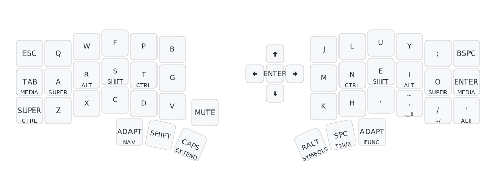
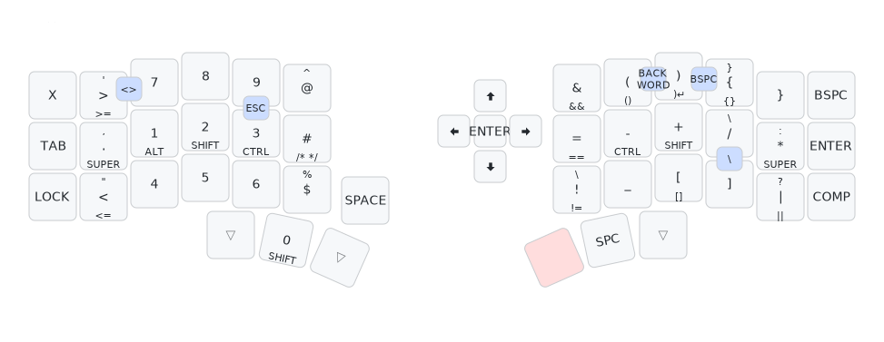
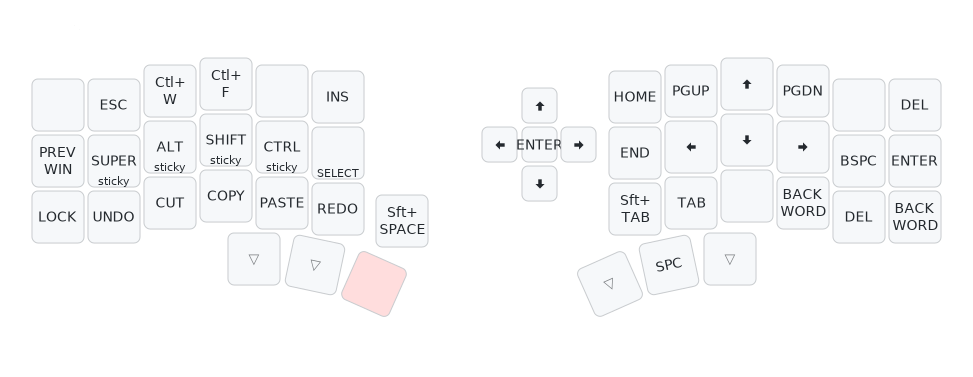
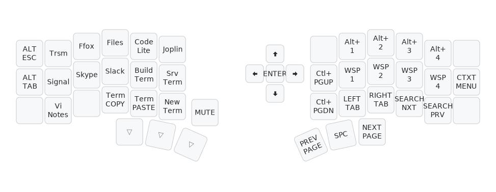
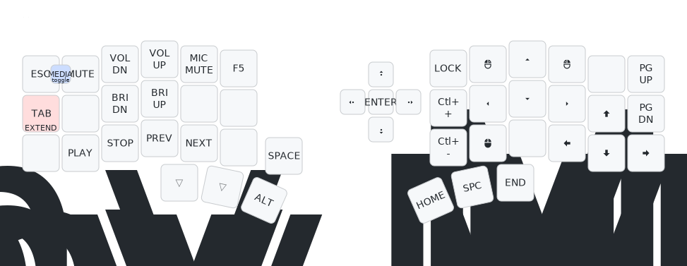
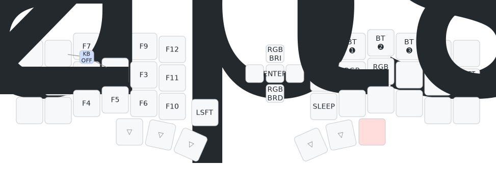
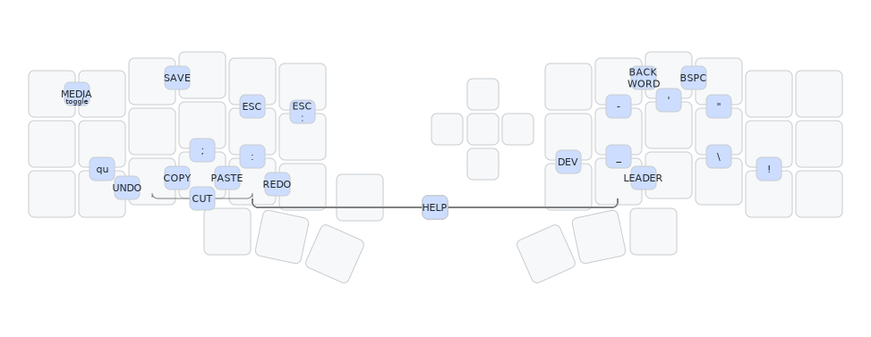

# ZMK Keyboard config

This repo contains configuration files for keyboards using the ZMK firmware.

I am slowly trying to replicate the keymap I use on
[my QMK keyboards](https://github.com/y-muller/personal_configs/blob/main/qmk_keyboards/CORNE42.md). I am making
a lot of changes along the way, changes that I will port back to QMK.

## Corne-j

This is my first ZMK keyboard.

This keyboard is sold by several Chinese vendors, under different names. Despite the
name it has little to do with the original Corne. The layout is very similar, but adds
a rotary encoder on the left side and a five-way switch on the right. It has two low-power
screens that are compatible with the nice!view.

I am using these modules:
- [keyboard config](https://github.com/a741725193/zmk-new_corne)
- [leader-key](https://github.com/urob/zmk-leader-key) by urov
- [adaptive-key](https://github.com/urob/zmk-adaptive-key) by urob

##### What is missing or broken so far
- the SELECT mode is not as polished as in QMK. Releasing the SELECT key returns to the base layer even if the EXTEND layer key is still pressed
- the `tmux` mode (Ctrl-A prefix) is replaced by a layer and is not as flexible or complete
- layer locking is rather awkward (symbols, extend, media)
- external display switching is missing 
- the keymap-drawer config is still somewhat broken

### The layout

To get help, the combo `D` `H` shows the layout for the current layer on screen until both keys of the combo are released.
For the AltGr symbols tap the Symbols key before the help combo.

> The combo map is found [below](#combos).

The combo `M` `K` is the `DEV` key, a software development-oriented [adaptive key](ADAPTIVE.md). The `ADAPT` thumb keys are general
[adaptive keys](ADAPTIVE.md). The placement of the adaptive keys is not ideal, so that might change. This is still very experimental
at this stage. I am not really making the most of those. The `DEV` key, on the other hand, is absolutely fantastic.

The combo `H` `,` is the [`LEADER` key](LEADER_KEY.md), giving access to a few macros that don't fit easily into the keymap. There is some overlap in functionnality 
between the dev adaptive key and the leader key.

Long press macros: holding `/` types `~/` or `../` with Shift, holding `.` starts a new sentence with a dot, a space and a sticky Shift. With Shift, holding `.` 
types `~/workspace/`. Holding `Shift` `,` (backtick) starts a markdown code block with 3 backticks.

A long press on `(`, `{` or `[` closes the parenthesis or bracket and moves the cursor inside. A long press on `=`, `&`, `|` doubles the symbols,
`!` outputs `!=`. Shift adds spaces around those symbols.

While `SELECT` is pressed, the cursor keys select words (right and left) or lines (down and up).

The `GNOME` key is sending `F17` and its behaviour is configured in the OS settings. Currently: raise or lower window, move window with Shift, and
resize it with Ctrl.

Find next and previous work in several editors (F3 and Shift-F3). With Shift, switches to "Find in files" mode (F8 and Control-F8).   
Tab switching is with Control-Alt-PgUp/Dn and works is several editors and can be configured in gnome-terminal and others.  

The `Alt-Tab` and `Alt-Esc` keys activate the usual window selection mechanism, all apps and of the same app, respectively.

This layer is dedicated to browsing and other non-typing activities. It is accessed by holding the `ESC` or `Enter` keys or activated by the
combo `ESC` `Q`.

Holding Alt slows down the mouse movements.

I have not mapped all the RGB keys yet. I don't use the feature to it doesn't matter.

### Combos

> **The HELP and editing combos (COPY, CUT, PASTE, UNDO, REDO) are available on all the layers.**

Single quote `'` combo: A long press types two quotes and moves the cursor inside. Holding Shift types smart quotes instead `‘’`. Tapping AltGr before
the combo types a typographic apostrophe `’`.

Double quote `"` combo: A long press types two quotes and moves the cursor inside. Holding Shift types smart quotes instead `“”`.
Tapping AltGr before the long press outputs guillemets `«»`.

Tapping AltGr before the hyphen `-` combo types a non-breakable hyphen. AltGr before the colon `:` or semi-colon `;` combos types a non-breakable space
followed by the `:` or `;` and a normal space.
