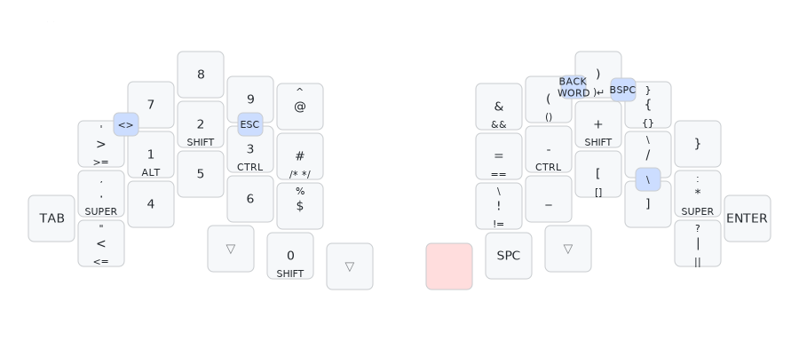
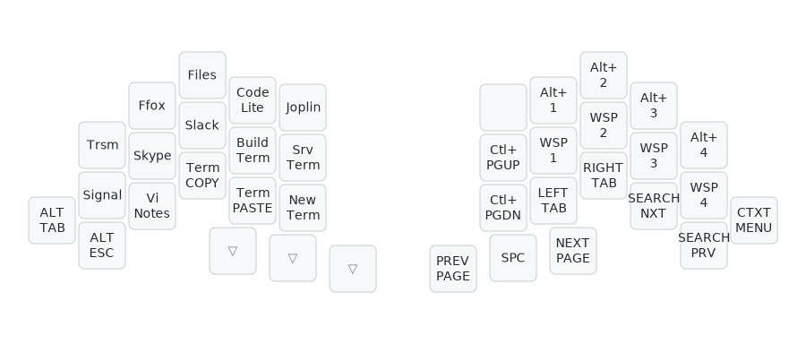
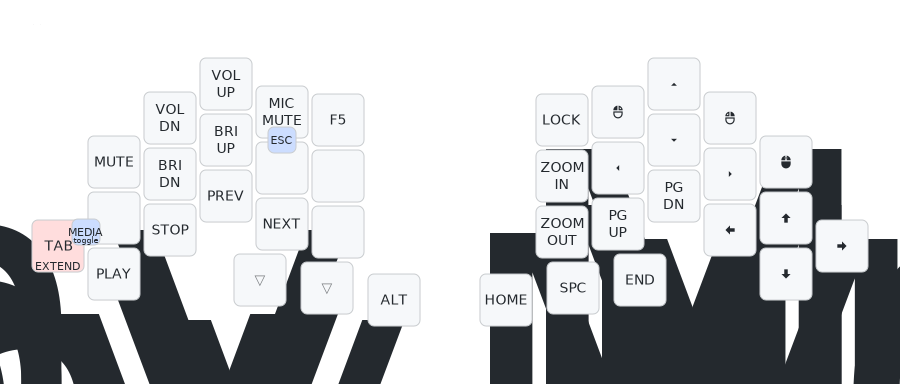
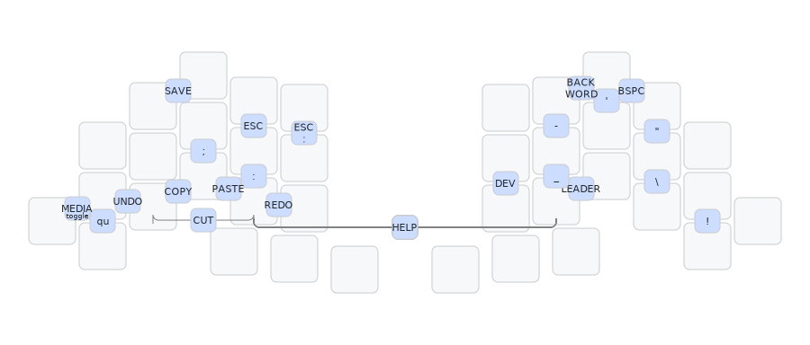

## The Totem layout

Only the differences to the [main layout](README.md) are documented here.

> The combo map is found [below](#combos).

The backspace key `BSPC` takes the place of `;:` which are only available as combos. `ESC` is also only available as a combo.

This layer is accessed by holding the `TAB` or `Enter` keys or activated by the
combo `TAB` `A`.

To accommodate the cursor keys in the bottom right, the `PGUP` and `PGDN` keys are moved.

### Combos

The UNDO combo is moved to `A` `X` as those keys are easier to press at the same time.
